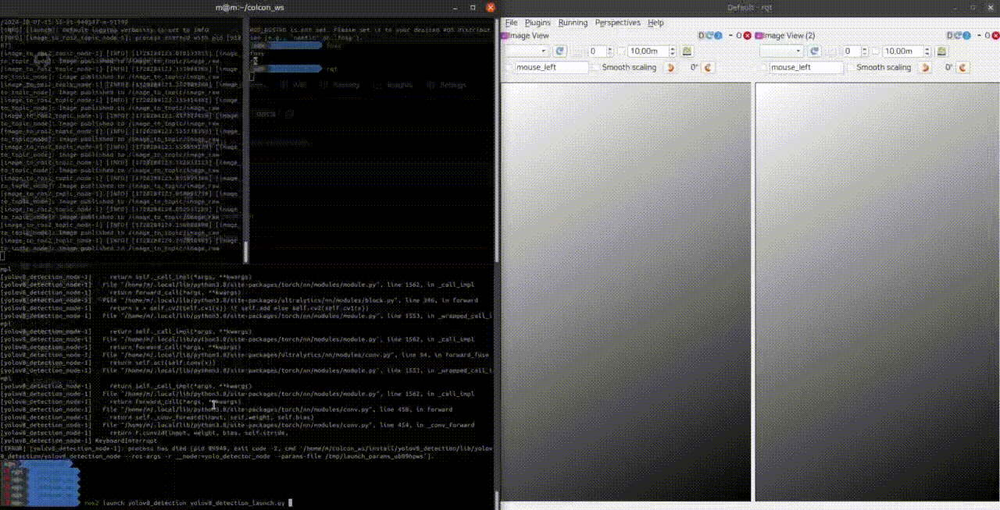

# YOLOv8 Detection Node

The `yolov8_detection` package is a ROS 2 node that utilizes the YOLOv8 model for real-time image recognition. This node subscribes to an image topic, processes the images using YOLOv8, draws bounding boxes on the detected objects, and publishes both the modified image and bounding box information. It supports both CPU and GPU inference and is easily configurable via ROS parameters.

## Key Features

- **YOLOv8 Inference**: Uses the YOLOv8 model for object detection, offering high accuracy and real-time performance.
- **GPU Support**: The node supports GPU inference if available, ensuring faster performance for object detection tasks.
- **Configurable Parameters**: The node's behavior, such as image topic, model path, and class labels, can be configured through parameters.
- **Bounding Box Publishing**: Detected objects are published as bounding boxes on a dedicated ROS topic, along with their class labels.
- **Image Output with Bounding Boxes**: The node publishes the processed image with bounding boxes drawn around detected objects.
- **Flexible Deployment**: The node can be deployed on a variety of systems, ranging from embedded devices to high-performance servers.

## Prerequisites

Before using this package, make sure the following dependencies are installed:

1. ROS 2 Foxy or later
2. [cv_bridge](https://github.com/ros-perception/vision_opencv)
3. [ultralytics](https://pypi.org/project/ultralytics/) (for YOLOv8 model)
4. [PyTorch](https://pytorch.org/) (with CUDA support if using GPU)
5. `image_recognition_msgs` package (for bounding box message type)

### Installing PyTorch and YOLOv8

To install the required libraries, run the following commands:

```bash
$ pip install torch torchvision torchaudio --index-url https://download.pytorch.org/whl/cu118  # For GPU support
$ pip install ultralytics
```

## Installation

1. Clone the repository into your ROS 2 workspace:
   ```bash
   $ cd ~/colcon_ws/src
   $ git clone https://github.com/mjlee111/image_recognition.git
   ```

2. Build the workspace:
   ```bash
   $ cd ~/colcon_ws
   $ colcon build
   ```

3. Source the workspace:
   ```bash
   $ source ~/colcon_ws/install/setup.bash
   ```

## Launching the Node

To launch the `yolov8_detection_node`, use the provided launch file. You can load parameters from a YAML file or pass them directly as launch arguments.

Example launch command:
```bash
$ ros2 launch yolov8_detection yolov8_detection_launch.py
```

## Parameters

The following parameters can be configured when launching the node:

| Parameter Name      | Type    | Default Value          | Description                                                                |
|---------------------|---------|------------------------|----------------------------------------------------------------------------|
| `image_topic`        | `string`| `/camera/image_raw`     | The ROS topic to subscribe to for input images.                            |
| `use_gpu`            | `bool`  | `False`                | Whether to use GPU for YOLOv8 inference.                                   |
| `model_path`         | `string`| `yolov8n.pt`           | Path to the YOLOv8 model file (.pt).                                       |
| `class_path`         | `string`| `class.txt`            | Path to the file containing class names for detected objects.               |
| `image_encoding`     | `string`| `bgr8`                 | Image encoding for input images (e.g., `bgr8`, `rgb8`).                    |

## ROS Topics

| Topic Name                      | Message Type                                | Role                                         |
|----------------------------------|---------------------------------------------|----------------------------------------------|
| **/camera/image_raw/yolo_bboxes**| `image_recognition_msgs/msg/BoundingBoxMsgs` | Publishes bounding box information for detected objects. |
| **/camera/image_raw/yolo_output**| `sensor_msgs/msg/Image`                     | Publishes the processed image with bounding boxes drawn on detected objects. |
| **/camera/image_raw**            | `sensor_msgs/msg/Image`                     | Subscribes to real-time image data from the camera.        |

## Using GPU for YOLO Inference

To enable GPU inference, set the `use_gpu` parameter to `True` and ensure you have a CUDA-compatible device with PyTorch installed for GPU support.

Example command:
```bash
$ ros2 launch yolov8_detection yolov8_detection_launch.py use_gpu:=True
```

## Image with Bounding Boxes

In addition to publishing bounding box information, the node also publishes the processed image with bounding boxes drawn around detected objects. This can be useful for visual verification of the detections.

The processed image is published on the `yolo_output` topic, and each detected object's bounding box color is chosen randomly and consistently applied to objects of the same class.

## Example with classic yolo test image
Using `image_to_ros2_topic`, sample image test can be done.



